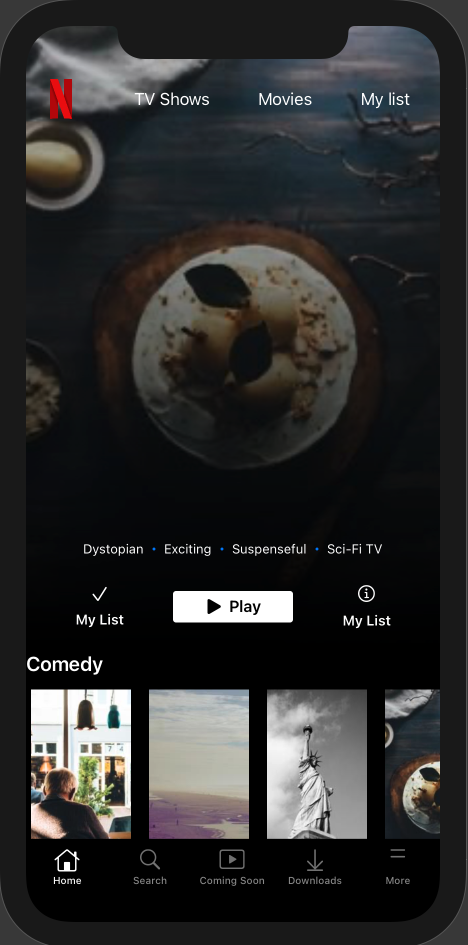
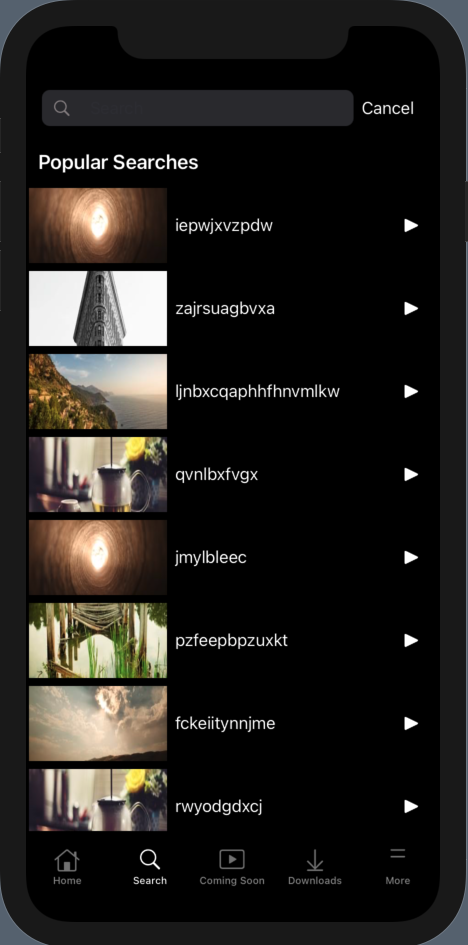
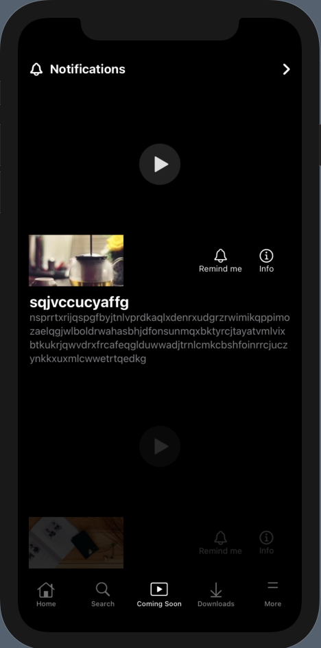
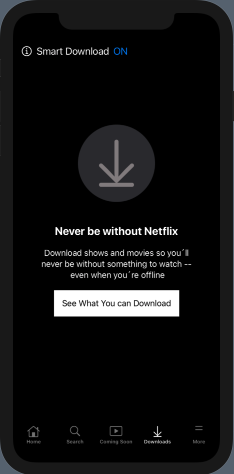

###  Netflix Clone app (SwiftUI)

This pet project repo has been used to build a Netflix clone app using SwiftUI following this course: https://www.udemy.com/course/swiftui-netflix/. 

The images have been provided by: https://picsum.photos/

***Third Parties:***
- Kinfisher, was used for downloading the pictures from the provider.

Here some app images:

***Home View:***

***Search View:***

***Coming Soon View:***

***Download View:***

